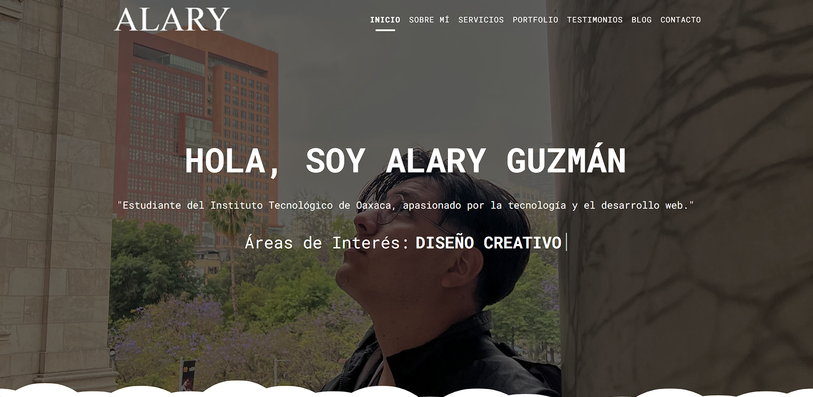
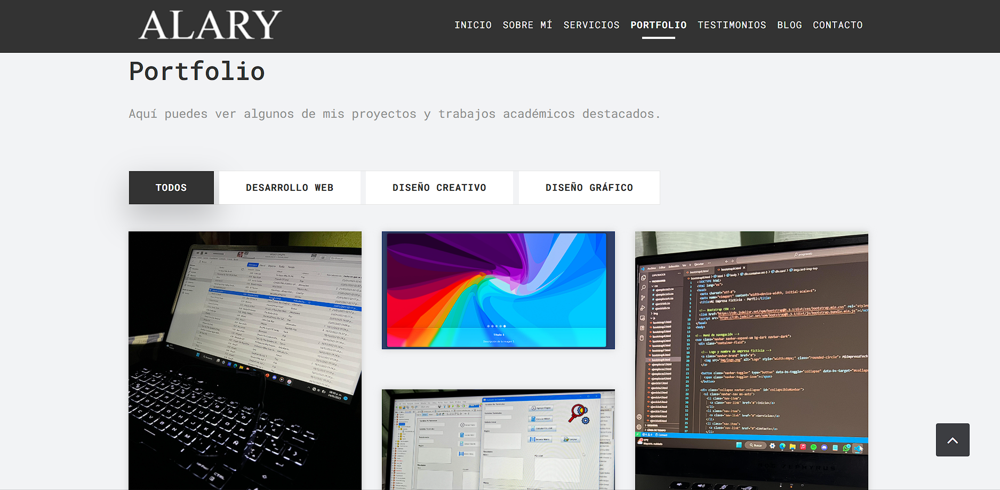
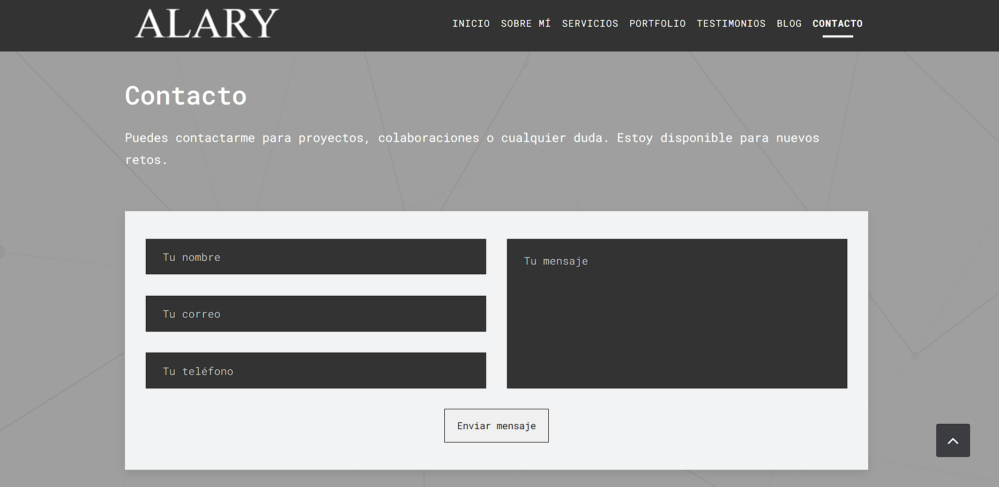

# Portafolio Personal - Alary Guzmán

## Descripción
Este proyecto es un portafolio web personal desarrollado con HTML, CSS y JavaScript utilizando una plantilla basada en Bootstrap. El propósito es mostrar información personal, proyectos y habilidades de manera visual e interactiva.

---

## Estructura del sitio

- **Inicio**: Presentación principal con imagen destacada.
- **Sobre mí**: Sección con información personal.
- **Portafolio**: Galería de trabajos con efecto hover y visualización con prettyPhoto.
- **Blog**: Muestra de entradas o noticias recientes.
- **Contacto**: Formulario para enviar mensajes por correo.

---

## Tecnologías Usadas

- HTML5 / CSS3
- Bootstrap 4 
- JavaScript / jQuery
- Plugins como prettyPhoto, Owl Carousel

---

## 📷 Capturas de Pantalla

| Página Principal | Portafolio | Contacto |
|------------------|------------|----------|
|  |  |  |

---

##  GitHub Pages

Puedes ver el sitio publicado aquí:  
➡ [https://alaryguzman.github.io/Portafolio/](https://alaryguzman.github.io/Portafolio/)

---

## 📎 Créditos

- **Plantilla base**: [Dominic – Free Bootstrap 4 HTML5 Portfolio Website Template](https://themewagon.com/themes/free-bootstrap-4-html5-portfolio-website-template-dominic/)
- **Desarrollo y adaptación**: Alary Guzmán
